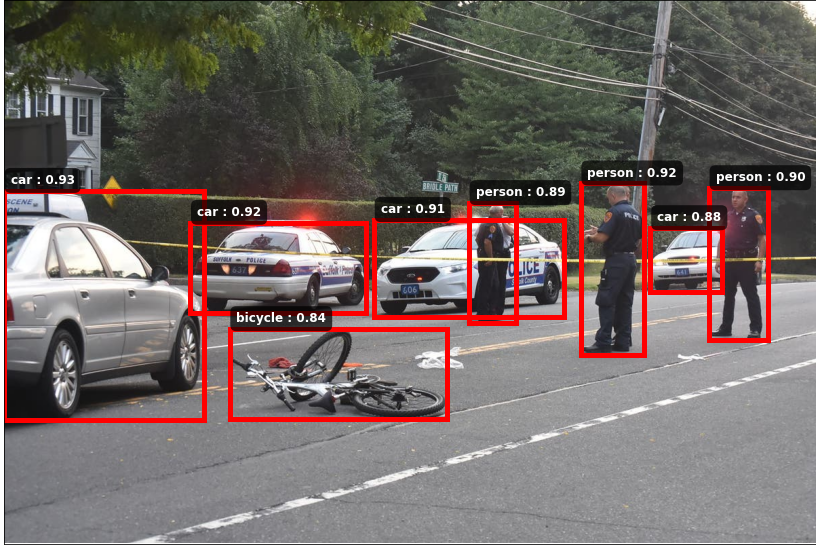
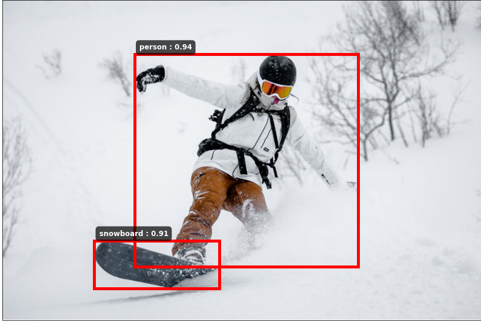
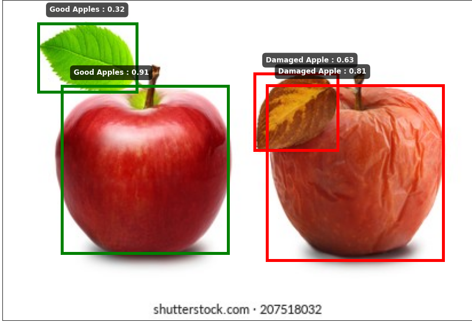

# Object_Detection_With_YOLO V8
YOLO Object Detection

1. https://colab.research.google.com/drive/1ADrrtE-F74BUJtN1lzIfFgd9glwsf8wK?usp=share_link For Train Yolo

2. YOLO_Object_Detection.ipynb prediction

Dataset: https://universe.roboflow.com/

YOLO Model: https://github.com/ultralytics/ultralytics

Some Output For Pretrain YOLO

Some Output For Custom Train For Bad and Good Apple

